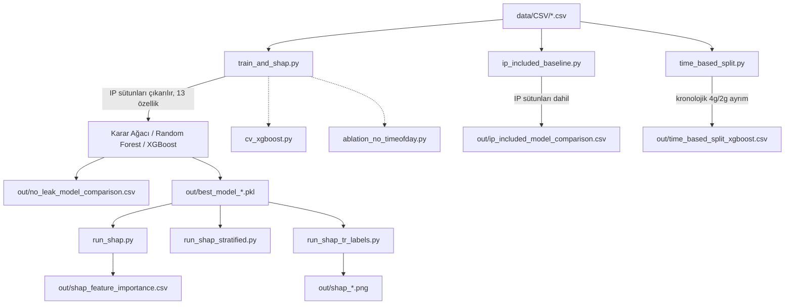

# ISCXIDS2012: IP Sızıntısından Arındırılmış SHAP Analizi

ISCXIDS2012 veri seti üzerinde IP tabanlı özellik sızıntısını ölçen, IP'siz koşulda Karar Ağacı / Random Forest / XGBoost karşılaştırması yapan ve en iyi model için SHAP tabanlı açıklanabilirlik analizi üreten pipeline.

## Veri

Veri seti bu depoda yer almaz. `TestbedSatJun12Flows.csv` ... `TestbedThuJun17Flows.csv` (6 dosya) [unb.ca/cic/datasets/ids.html](https://www.unb.ca/cic/datasets/ids.html) adresinden indirilip `data/CSV/` altına konmalıdır.

## Akış



## Çalıştırma sırası

```bash
pip install -r requirements.txt
python train_and_shap.py
python cv_xgboost.py
python ablation_no_timeofday.py
python ip_included_baseline.py
python time_based_split.py
python run_shap.py
python run_shap_stratified.py
python run_shap_tr_labels.py
```

## Dosyalar

| Dosya | Çıktı |
|---|---|
| `train_and_shap.py` | IP'siz 3-model karşılaştırması, en iyi model, parquet/pkl çıktıları |
| `cv_xgboost.py` | XGBoost için 5-katlı stratifiye çapraz doğrulama |
| `ablation_no_timeofday.py` | startTimeOfDay/stopTimeOfDay çıkarılınca performans |
| `ip_included_baseline.py` | Aynı ayrım/hiperparametrelerle IP dahil kontrollü karşılaştırma |
| `time_based_split.py` | Kronolojik (zamana dayalı) eğitim/test ayrımı |
| `run_shap.py` | SHAP değerleri, beeswarm/bar/waterfall grafikleri (rastgele örneklem) |
| `run_shap_stratified.py` | Aynı analiz, sınıf oranı korunan stratifiye örneklem |
| `run_shap_tr_labels.py` | Grafiklerin Türkçe eksen/lejant etiketleriyle üretimi |

`random_state=42` tüm bölünme ve modellerde sabittir.

## Atıf

Bu kod, aşağıdaki makalenin deneysel sonuçlarını üretmek için kullanılmıştır:

Akca, Ş., & Urfalıoğlu, M. (2026). ISCXIDS2012 Veri Setinde IP Sızıntısından Arındırılmış Açıklanabilir Saldırı Tespiti: XGBoost, Random Forest ve Karar Ağacı Modellerinin SHAP ile Karşılaştırılması. *Siber Güvenlik ve Dijital Ekonomi Dergisi*.

## Lisans

MIT (bkz. `LICENSE`).
